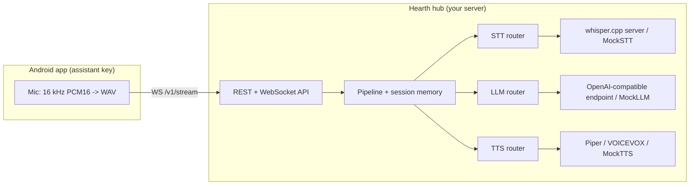

# Hearth

[English](README.md) | [中文](README.zh.md) | [日本語](README.ja.md)

 [](LICENSE) [](CHANGELOG.md)  

**オープンソースのセルフホスト音声アシスタント hub。スマホがマイクになり、自宅サーバーが頭脳になります。**


```bash
git clone https://github.com/JaydenCJ/hearth.git && cd hearth/server && npm install && npm run build
```

## なぜ Hearth なのか

Google は Assistant を Gemini に置き換え、スマホに話しかけた言葉はすべて他人のクラウドに送られるようになりました。自宅サーバーがあれば、プライベートな音声アシスタントの部品はすでに揃っています。音声認識は whisper.cpp、音声合成は Piper と VOICEVOX、言語モデルは llama.cpp や Ollama。足りないのは、それらをポケットの中のスマホにつなぐ配線だけです。Hearth がその配線です。アシスタントキーを押して話すと、音声は自分のハードウェアだけに届きます。

|  | Hearth | Home Assistant Voice | Mycroft |
|---|---|---|---|
| マイク / 入口デバイス | 手元のスマホ | 専用ハードウェア | 専用スピーカー |
| 必要なエコシステム | なし | Home Assistant | なし |
| プロジェクトの状態 | 活発 | 初期段階 | 停止（2023） |
| LLM 層 | 任意の OpenAI 互換 + routing rules | HA conversation agents | ルールベースの skills |
| VOICEVOX 日本語 TTS | 内蔵アダプター | 内蔵なし | 内蔵なし |

## 特徴

- **追加ハードウェア不要** — Kotlin 製 Android アプリがシステムのアシスタントロール（`RoleManager.ROLE_ASSISTANT` / `VoiceInteractionService`）を引き受けるため、アシスタントキーやジェスチャーで Gemini ではなく Hearth が起動します。
- **音声データは家から出ない** — STT・LLM・TTS はすべて自分のマシン上で動作します。hub はデフォルトで `127.0.0.1` にのみバインドし、任意の bearer token に対応、テレメトリはありません。
- **全レイヤーが差し替え可能** — STT は whisper.cpp、TTS は Piper と VOICEVOX、LLM は任意の OpenAI 互換エンドポイント（llama.cpp、Ollama、vLLM、LM Studio、クラウド API）。Hearth 自体はモデルを同梱せず、すでに動かしているエンジンに接続します。
- **レイヤーごとの routing rules** — 言語・キーワード・正規表現・テキスト長・クライアント tag で振り分けます。プライベートな内容はローカルモデルに残し、クラウドバックエンドを設定しなければ完全オフラインで動きます。
- **日本語をファーストクラスに** — YAML のルール 1 行で日本語の返答を VOICEVOX（ずんだもん等）へ、それ以外を Piper へルーティングできます。
- **ハードウェアゼロで今すぐ試せる** — 全レイヤーに決定的な mock が付属し、デモ・API・テストスイートは GPU もモデルも外部サービスもなしで動きます。

## クイックスタート

ゼロから話せる hub まで 5 ステップです。ステップ 1〜4 に必要なのは Node.js >= 20 だけです。

**1. クローンしてビルドします:**

```bash
git clone https://github.com/JaydenCJ/hearth.git && cd hearth/server && npm install && npm run build
```

**2. 話しかけます — ハードウェア不要の全 mock パイプライン:**

```bash
printf 'hello\nこんにちは\nwhat time is it?\nexit\n' | node dist/cli.js demo --mock
```

出力（実際の実行結果のコピー）:

```text
Hearth v0.1.0 demo — type a message, Ctrl-D or 'exit' to quit.
you: hello
hearth [llm=mock 1ms]: Hello, I am Hearth, your self-hosted assistant.
you: こんにちは
hearth [llm=mock 0ms]: こんにちは。Hearthです。ご用件をどうぞ。
you: what time is it?
hearth [llm=mock 0ms]: It is 05:08.
```

**3. hub を起動して API を呼びます:**

```bash
node dist/cli.js serve --mock &
curl http://127.0.0.1:8321/v1/health
```

出力:

```text
{"status":"ok","version":"0.1.0","backends":{"stt":["mock"],"tts":["mock"],"llm":["mock"]},"defaults":{"stt":"mock","tts":"mock","llm":"mock"}}
```

**4. 実エンジンをつなぎます** — サンプル設定をコピーし、whisper.cpp・Piper/VOICEVOX・LLM エンドポイントの URL を書き換えます:

```bash
cp examples/hearth.example.yaml hearth.yaml
node dist/cli.js check-config -c hearth.yaml
node dist/cli.js serve -c hearth.yaml
```

**5. あるいは Docker Compose で起動し、スマホをつなぎます:**

```bash
docker compose up -d
```

compose ファイルはイメージのバージョンを固定し（`hearth-server:0.1.0`）、hub を `127.0.0.1:8321` にのみ公開し、healthcheck を定義し、設定を named volume `hearth-config` に保持します。そこに `hearth.yaml` を置くと mock モードを抜けられ、ホスト移行時はこのファイル 1 つをバックアップするだけです。最後に Android アプリ（`android/`、Android 10+）をビルドし、設定画面で hub のアドレスを入力して "Set Hearth as device assistant" をタップしてください。

> **検証に関する注記**: 開発コンテナは Docker registry へのアクセスを遮断しているため、この compose ステップは Quickstart の中で唯一エンドツーエンドで実行できていないコマンドです（`docker compose config` による検証のみ）。同じサーバーコードは直接起動で検証済みです（ステップ 2〜4 と `scripts/smoke.sh`）。compose で問題があれば Issue を作成してください。

実測フットプリント: hub のアイドル時 RSS は約 75 MB です（Node 22、全 mock 設定）。

## アーキテクチャ



各レイヤーは名前付きバックエンドと first-match-wins の routing rules を持ち、リクエスト側でバックエンドを明示的に固定することもできます。client-server の完全な契約（REST + WebSocket のフレーム順序）は [docs/protocol.md](docs/protocol.md) に、コメント付きのサンプル設定は [server/examples/hearth.example.yaml](server/examples/hearth.example.yaml) にあります。

## 開発

サーバー（TypeScript、Node.js >= 20）— 以下のコマンドは Linux でそのまま実行できます:

```bash
cd server
npm install
npm run build
npm test
cd .. && bash scripts/smoke.sh
```

直近のローカル実行では `npm test` が `Tests  77 passed (77)` を出力し、`bash scripts/smoke.sh` は `SMOKE OK` で終了します。

`npm test` は vitest スイート（設定パース、ルーティング、パイプラインのオーケストレーション、ローカルの偽エンジンに対するアダプターのリクエスト構築、REST/WebSocket の往復）を実行します。ネットワーク・GPU・モデルのダウンロードは不要です。Android アプリ（`android/`）は Android Studio（SDK 35、minSdk 29）で開けますが、ビルドには Android SDK が必要です。プラットフォーム非依存のコア（WebSocket プロトコルのコーデック、WAV ライター、エンドポインター）は純粋な JVM モジュール `android/core` にあり、そのユニットテストは Android SDK なしで `./gradlew :core:test` で実行できます（初回実行時に Gradle が本体と依存をダウンロードします）。

## ロードマップ

- [x] v0.1.0 — ルーティング可能な STT / LLM / TTS hub、REST + WebSocket API、Android アシスタントキー対応クライアント、全 mock デモモード
- [ ] チャンク単位の streaming STT による初語レイテンシの短縮
- [ ] Android アプリのウェイクワード対応
- [ ] Shortcuts 経由の iOS 入口
- [ ] Home Assistant ブリッジ（hub を conversation agent として公開）

全体は [open issues](https://github.com/JaydenCJ/hearth/issues) を参照してください。

## コントリビューション

コントリビューションを歓迎します。まず [CONTRIBUTING.md](CONTRIBUTING.md) を読み、[good first issue](https://github.com/JaydenCJ/hearth/issues?q=is%3Aissue+is%3Aopen+label%3A%22good+first+issue%22) から始めるか、[Issues](https://github.com/JaydenCJ/hearth/issues) でお気軽にどうぞ。

## ライセンス

[MIT](LICENSE)
