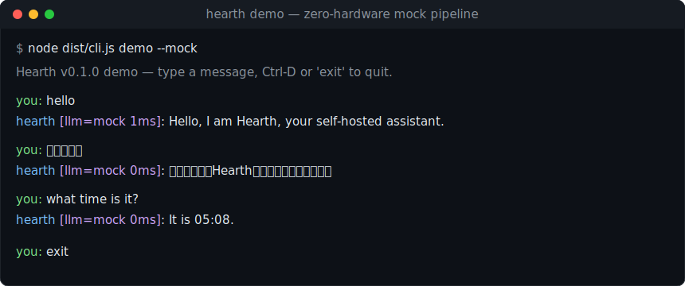
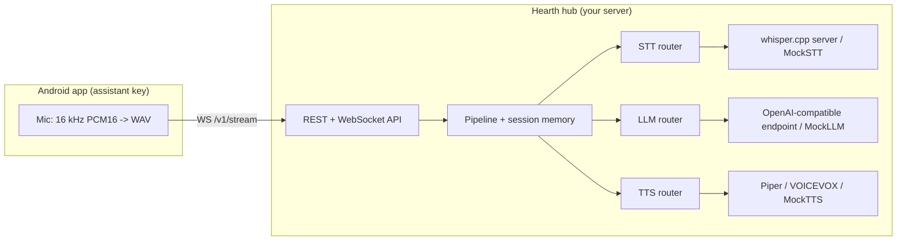

# Hearth

[English](README.md) | [中文](README.zh.md) | [日本語](README.ja.md)

 [](LICENSE) [](CHANGELOG.md)  

**An open-source, self-hosted voice assistant hub — your phone is the microphone, your home server does the thinking.**



```bash
git clone https://github.com/JaydenCJ/hearth.git && cd hearth/server && npm install && npm run build
```

## Why Hearth?

Google retired Assistant in favor of Gemini, and every word you say to your phone now belongs to someone else's cloud. If you run a home server, the pieces of a private voice assistant already exist — whisper.cpp for speech recognition, Piper and VOICEVOX for speech synthesis, llama.cpp or Ollama for the language model — but nothing wires them into the phone in your pocket. Hearth is that wiring: press the assistant key, speak, and the audio goes to your hardware and nowhere else.

|  | Hearth | Home Assistant Voice | Mycroft |
|---|---|---|---|
| Microphone / entry device | your existing phone | dedicated hardware | dedicated speaker |
| Ecosystem required | none | Home Assistant | none |
| Project status | active | early stage | halted (2023) |
| LLM layer | any OpenAI-compatible + routing rules | HA conversation agents | rule-based skills |
| VOICEVOX Japanese TTS | built-in adapter | not built-in | not built-in |

## Features

- **Zero extra hardware** — the Kotlin Android app takes over the system assistant role (`RoleManager.ROLE_ASSISTANT` / `VoiceInteractionService`), so the assistant key or gesture opens Hearth instead of Gemini.
- **Voice data stays home** — STT, LLM and TTS all run on machines you own; the hub binds `127.0.0.1` by default, supports an optional bearer token, and sends no telemetry.
- **Every layer swappable** — whisper.cpp for STT, Piper and VOICEVOX for TTS, any OpenAI-compatible endpoint (llama.cpp, Ollama, vLLM, LM Studio, or a cloud API) for the LLM. Hearth ships no models — you point it at engines you already run.
- **Routing rules per layer** — match on language, keywords, regex, prompt length or client tags; keep private prompts on the local model, and go fully offline by simply not configuring a cloud backend.
- **Japanese as a first-class citizen** — one YAML rule routes Japanese replies to VOICEVOX (ずんだもん and friends), everything else to Piper.
- **Works with zero hardware today** — every layer ships a deterministic mock, so the demo, the API and the test-suite run without a GPU, models or external services.

## Quickstart

Five steps from zero to a talking hub. Steps 1–4 need only Node.js >= 20.

**1. Clone and build:**

```bash
git clone https://github.com/JaydenCJ/hearth.git && cd hearth/server && npm install && npm run build
```

**2. Talk to it — no hardware, all-mock pipeline:**

```bash
printf 'hello\nこんにちは\nwhat time is it?\nexit\n' | node dist/cli.js demo --mock
```

Output (copied from a real run):

```text
Hearth v0.1.0 demo — type a message, Ctrl-D or 'exit' to quit.
you: hello
hearth [llm=mock 1ms]: Hello, I am Hearth, your self-hosted assistant.
you: こんにちは
hearth [llm=mock 0ms]: こんにちは。Hearthです。ご用件をどうぞ。
you: what time is it?
hearth [llm=mock 0ms]: It is 05:08.
```

**3. Start the hub and call the API:**

```bash
node dist/cli.js serve --mock &
curl http://127.0.0.1:8321/v1/health
```

Output:

```text
{"status":"ok","version":"0.1.0","backends":{"stt":["mock"],"tts":["mock"],"llm":["mock"]},"defaults":{"stt":"mock","tts":"mock","llm":"mock"}}
```

**4. Wire up real engines** — copy the example config and point it at your whisper.cpp, Piper/VOICEVOX and LLM endpoints:

```bash
cp examples/hearth.example.yaml hearth.yaml
node dist/cli.js check-config -c hearth.yaml
node dist/cli.js serve -c hearth.yaml
```

**5. Or run it with Docker Compose, then connect the phone:**

```bash
docker compose up -d
```

The compose file pins the image (`hearth-server:0.1.0`), publishes the hub on `127.0.0.1:8321` only, defines a healthcheck, and keeps your configuration on the named volume `hearth-config` — drop a `hearth.yaml` there to leave mock mode, and back up that one file to migrate hosts. Finally build the Android app (`android/`, Android 10+), set the hub address on its settings screen and tap "Set Hearth as device assistant".

> **Verification note**: the development container blocks Docker registry pulls, so this compose step is the one Quickstart command we have not run end-to-end yet — it is validated with `docker compose config` only. The identical server code path is exercised by running it directly (steps 2–4 and `scripts/smoke.sh`). If compose misbehaves for you, please open an issue.

Measured footprint: the hub idles at about 75 MB RSS (Node 22, all-mock configuration).

## Architecture



Each layer has named backends plus first-match-wins routing rules; a request can also pin a backend explicitly. The full client–server contract (REST + WebSocket frame sequence) lives in [docs/protocol.md](docs/protocol.md), and the annotated example configuration in [server/examples/hearth.example.yaml](server/examples/hearth.example.yaml).

## Development

Server (TypeScript, Node.js >= 20) — these exact commands run on Linux:

```bash
cd server
npm install
npm run build
npm test
cd .. && bash scripts/smoke.sh
```

Latest local run: `npm test` reports `Tests  77 passed (77)` (vitest) and `bash scripts/smoke.sh` ends with `SMOKE OK`.

`npm test` runs the vitest suite (config parsing, routing, pipeline orchestration, adapter request construction against local fake engines, REST/WebSocket round-trips) with no network, GPU or model downloads. The Android app (`android/`) opens in Android Studio (SDK 35, minSdk 29) and needs the Android SDK to build; its platform-independent core (WebSocket protocol codec, WAV writer, endpointer) lives in the pure-JVM module `android/core`, whose unit tests run without the Android SDK via `./gradlew :core:test` (Gradle downloads its distribution and dependencies on first run).

## Roadmap

- [x] v0.1.0 — routable STT / LLM / TTS hub, REST + WebSocket API, Android assistant-key client, all-mock demo mode
- [ ] Chunked streaming STT for lower first-word latency
- [ ] Wake-word support in the Android app
- [ ] iOS entry point via Shortcuts
- [ ] Home Assistant bridge (expose the hub as a conversation agent)

See the [open issues](https://github.com/JaydenCJ/hearth/issues) for the full list.

## Contributing

Contributions are welcome — read [CONTRIBUTING.md](CONTRIBUTING.md), then start with a [good first issue](https://github.com/JaydenCJ/hearth/issues?q=is%3Aissue+is%3Aopen+label%3A%22good+first+issue%22) or open an [issue](https://github.com/JaydenCJ/hearth/issues).

## License

[MIT](LICENSE)
