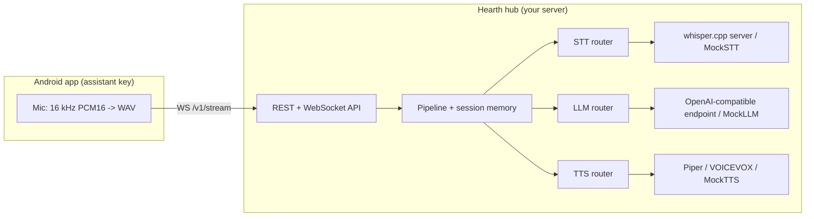

# Hearth

[English](README.md) | [中文](README.zh.md) | [日本語](README.ja.md)

 [](LICENSE) [](CHANGELOG.md)  

**开源自托管语音助手 hub——手机是麦克风，家庭服务器负责思考。**


```bash
git clone https://github.com/JaydenCJ/hearth.git && cd hearth/server && npm install && npm run build
```

## 为什么是 Hearth？

Google 用 Gemini 取代了 Assistant，你对手机说的每一句话如今都归别人的云端所有。如果你有一台家庭服务器，私有语音助手的零件其实早已齐备——whisper.cpp 负责语音识别、Piper 和 VOICEVOX 负责语音合成、llama.cpp 或 Ollama 跑语言模型——但没有任何东西把它们接进你口袋里的手机。Hearth 就是这根连线：按下助手键、开口说话，音频只流向你自己的硬件，不去任何别的地方。

|  | Hearth | Home Assistant Voice | Mycroft |
|---|---|---|---|
| 麦克风 / 入口设备 | 你现有的手机 | 专用硬件 | 专用音箱 |
| 依赖的生态 | 无 | Home Assistant | 无 |
| 项目状态 | 活跃 | 早期阶段 | 已停摆（2023） |
| LLM 层 | 任意 OpenAI 兼容端点 + 路由规则 | HA conversation agents | 基于规则的 skills |
| VOICEVOX 日语 TTS | 内置适配器 | 无内置 | 无内置 |

## 特性

- **零额外硬件** —— Kotlin Android app 接管系统助手角色（`RoleManager.ROLE_ASSISTANT` / `VoiceInteractionService`），助手键或手势唤起的不再是 Gemini 而是 Hearth。
- **语音数据不出家门** —— STT、LLM、TTS 全部运行在你自己的机器上；hub 默认只绑定 `127.0.0.1`，支持可选的 bearer token，没有任何遥测。
- **每一层都可替换** —— STT 用 whisper.cpp，TTS 用 Piper 和 VOICEVOX，LLM 接任意 OpenAI 兼容端点（llama.cpp、Ollama、vLLM、LM Studio 或云端 API）。Hearth 自身不带任何模型——它对接的是你已经在跑的引擎。
- **每层独立的路由规则** —— 按语言、关键词、正则、文本长度或客户端 tag 匹配；隐私内容留在本地模型上，不配置云端后端即可完全离线。
- **日语是一等公民** —— 一条 YAML 规则即可把日语回复路由给 VOICEVOX（ずんだもん等），其余交给 Piper。
- **今天就能零硬件跑起来** —— 每层都自带确定性 mock，demo、API 和测试套件无需 GPU、模型或外部服务。

## 快速开始

五步从零到一台会说话的 hub。第 1–4 步只需要 Node.js >= 20。

**1. 克隆并构建：**

```bash
git clone https://github.com/JaydenCJ/hearth.git && cd hearth/server && npm install && npm run build
```

**2. 直接对话——零硬件、全 mock 管线：**

```bash
printf 'hello\nこんにちは\nwhat time is it?\nexit\n' | node dist/cli.js demo --mock
```

输出（拷贝自真实运行）：

```text
Hearth v0.1.0 demo — type a message, Ctrl-D or 'exit' to quit.
you: hello
hearth [llm=mock 1ms]: Hello, I am Hearth, your self-hosted assistant.
you: こんにちは
hearth [llm=mock 0ms]: こんにちは。Hearthです。ご用件をどうぞ。
you: what time is it?
hearth [llm=mock 0ms]: It is 05:08.
```

**3. 启动 hub 并调用 API：**

```bash
node dist/cli.js serve --mock &
curl http://127.0.0.1:8321/v1/health
```

输出：

```text
{"status":"ok","version":"0.1.0","backends":{"stt":["mock"],"tts":["mock"],"llm":["mock"]},"defaults":{"stt":"mock","tts":"mock","llm":"mock"}}
```

**4. 接入真实引擎** —— 复制示例配置，把 URL 指向你的 whisper.cpp、Piper/VOICEVOX 和 LLM 端点：

```bash
cp examples/hearth.example.yaml hearth.yaml
node dist/cli.js check-config -c hearth.yaml
node dist/cli.js serve -c hearth.yaml
```

**5. 或者用 Docker Compose 运行，然后连接手机：**

```bash
docker compose up -d
```

compose 文件固定镜像版本（`hearth-server:0.1.0`），只在 `127.0.0.1:8321` 上发布 hub，定义了 healthcheck，配置保存在 named volume `hearth-config` 上——往里放一份 `hearth.yaml` 即可脱离 mock 模式，迁移主机时只需备份这一个文件。最后构建 Android app（`android/`，Android 10+），在设置页填入 hub 地址，点击 "Set Hearth as device assistant"。

> **验证说明**：开发容器无法访问 Docker registry，因此 compose 这一步是 Quickstart 中唯一尚未端到端跑通的命令——目前只用 `docker compose config` 做过校验。同一份 server 代码路径已通过进程直跑充分验证（第 2–4 步与 `scripts/smoke.sh`）。如果 compose 在你的环境有问题，请提 issue。

实测占用：hub 空闲时约 75 MB RSS（Node 22，全 mock 配置）。

## 架构



每一层都有具名后端和"首个匹配即胜出"的路由规则；请求也可以显式指定后端。完整的 client-server 契约（REST + WebSocket 帧序列）见 [docs/protocol.md](docs/protocol.md)，带注释的示例配置见 [server/examples/hearth.example.yaml](server/examples/hearth.example.yaml)。

## 开发

Server（TypeScript，Node.js >= 20）——以下命令可在 Linux 上原样执行：

```bash
cd server
npm install
npm run build
npm test
cd .. && bash scripts/smoke.sh
```

最近一次本地实跑：`npm test` 输出 `Tests  77 passed (77)`（vitest），`bash scripts/smoke.sh` 以 `SMOKE OK` 结束。

`npm test` 运行 vitest 套件（配置解析、路由、pipeline 编排、对本地假引擎的适配器请求构造、REST/WebSocket 往返），全程无网络、无 GPU、无模型下载。Android app（`android/`）用 Android Studio 打开（SDK 35，minSdk 29），构建需要 Android SDK；与平台无关的核心逻辑（WebSocket 协议编解码、WAV 封装、端点检测）在纯 JVM 模块 `android/core` 中，其单元测试无需 Android SDK，`./gradlew :core:test` 即可运行（Gradle 首次运行会下载发行版与依赖）。

## 路线图

- [x] v0.1.0 —— 可路由的 STT / LLM / TTS hub、REST + WebSocket API、Android 助手键客户端、全 mock demo 模式
- [ ] 分块流式 STT，降低首词延迟
- [ ] Android app 的唤醒词支持
- [ ] 通过 Shortcuts 提供 iOS 入口
- [ ] Home Assistant 桥接（把 hub 暴露为 conversation agent）

完整列表见 [open issues](https://github.com/JaydenCJ/hearth/issues)。

## 参与贡献

欢迎贡献——先读 [CONTRIBUTING.md](CONTRIBUTING.md)，然后从 [good first issue](https://github.com/JaydenCJ/hearth/issues?q=is%3Aissue+is%3Aopen+label%3A%22good+first+issue%22) 入手，或提交 [issue](https://github.com/JaydenCJ/hearth/issues) 参与讨论。

## 许可证

[MIT](LICENSE)
